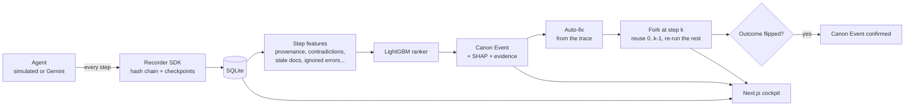

# Black Box

**A flight recorder for AI agents. Record → Blame → Fork → Prove.**

When an agent fails at step 19, the real mistake was often made at step 6. Black Box records
every step an agent takes, uses a trained model to find the step that actually caused the
failure (the *Canon Event*), forks the run from a checkpoint at that step, applies a fix,
re-runs only what follows, and shows the outcome flip from fail to success.

## How it works



| Problem statement feature | Where it lives |
|---|---|
| Execution data | `blackbox_sdk/` recorder, `agent_sim/` ShopOps sandbox, 5,000 labelled runs |
| Failure diagnosis | `ml/` LightGBM LambdaRank step ranker ("Find the cause" on a run) |
| Failure explanation | SHAP contributions + evidence sentences, optional Gemini incident report |
| Checkpointed replay | content-addressed checkpoint after every step; forks resume from it |
| Alternative execution | edits to args, outputs, LLM decisions, documents or the prompt (API), auto-fix ("Fix this step and replay"), multiverse sweep |
| Model evaluation | `make eval`: Top-1/Top-3/MRR vs four baselines, held-out fault types and task family |
| Trace comparison | `/api/compare`: aligned runs, split point, outcome change, steps and tokens saved; before/after proof in the UI |

## Results

<!-- results:start -->
| Split | Black Box ranker Top-1 | Top-3 | Gemini as judge Top-1 | Last action | First error | Random |
|---|---|---|---|---|---|---|
| Test (in-distribution) | **100.0%** | 100.0% | 76.0% | 16.0% | 13.7% | 7.5% |
| Held-out task family | **95.5%** | 99.2% | 79.2% | 9.2% | 11.7% | 9.8% |
| Held-out fault types | **57.2%** | 89.8% | 36.0% | 0.0% | 0.0% | 7.6% |

Auto-fix at the top-ranked step flips 98.0% of failed test runs to success; a sweep over the top 3 flips 91.3% on unseen fault types. Forks reuse 49.6% of the original steps.

_Generated by `make eval` (2026-10-04T09:29:56+00:00). Full report: [docs/eval_report.md](docs/eval_report.md)._
<!-- results:end -->

How the data is made: a scripted support agent works through five task types in a sandbox
shop. For labelled failures we corrupt exactly one step (nine fault types) and record which
one. Successful runs include harmless noise (retried errors, re-asked queries, extra lookups)
so errors alone are not a giveaway, and faults usually surface several steps later, so
blaming the last step does not work. Prompt injection, state corruption and the complaint
triage task are held out of training entirely.

## Run it

```bash
make setup     # python venv + frontend packages, copies .env.example to .env
make data      # 5,000 runs -> data/runs.jsonl, seeds data/blackbox.db
make train     # ranker + failure classifier -> ml/artifacts/
make eval      # metrics.json, docs/eval_report.md, the table above
make demo      # API on :8000 and the UI on :3000
make test
```

A Gemini key (`GEMINI_API_KEY`, `GEMINI_MODEL`) and a Groq key (`GROQ_API_KEY`) in `.env` are
optional. They power the second-opinion panel (two independent AIs review every diagnosis), the
incident report and the AI-as-judge baselines. Everything else runs offline.

API docs: http://localhost:8000/docs

## Deploy (free tiers)

**API on Render.** New Web Service from this repo, Docker runtime, free instance. Set
`GEMINI_API_KEY`, `GEMINI_MODEL`, `SEED_RUNS_ON_START=800` and
`ALLOWED_ORIGIN_REGEX=https://.*\.vercel\.app`; health check `/api/health`. The free instance
sleeps after ~15 minutes idle and re-seeds its database on start.

**UI on Vercel.** Import the repo with root directory `frontend` and set
`NEXT_PUBLIC_API_URL=https://<render-service>.onrender.com/api`.

## Layout

| Path | What |
|------|------|
| `blackbox_sdk/` | recorder SDK: steps, hash chain, checkpoints, SQLite/HTTP sinks |
| `agent_sim/` | ShopOps world, tools, tasks, scripted agent, faults, checker, replay, repair |
| `ml/` | features, baselines, training, evaluation, SHAP evidence |
| `backend/` | FastAPI app and services |
| `frontend/` | Next.js UI: home, runs, run story (cause, fix, proof), results, live |
| `tests/` | pytest suite (no ground-truth leakage, determinism, replay, API) |

Built by Team Hackerzzz for Bit N Build 2026.
