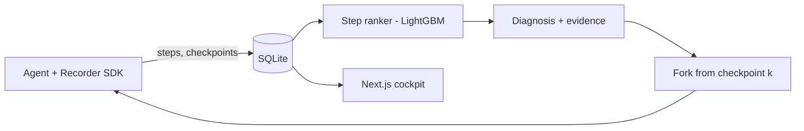

# Architecture

Record → Blame → Fork → Prove.

```mermaid
flowchart LR
  A[Agent + Recorder SDK] -->|steps, checkpoints| DB[(SQLite)]
  DB --> R[Step ranker - LightGBM]
  R --> D[Diagnosis + evidence]
  D --> F[Fork from checkpoint k]
  F --> A
  DB --> UI[Next.js cockpit]
```

Filled in as each piece lands.
